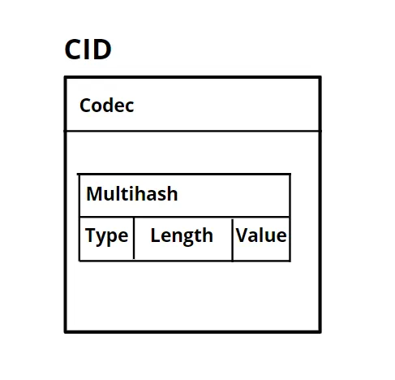

# Concepts
***
**~(*software engineering*)**
* **ACID**: Atomicity. Consistency. Isolated. Durable.
* **CAP Theorem**: Consistency. Availability. Partition Tolerance

**~(*networking*)**
* **protocol**: A set of rules and conventions that dictate how data is *formatted, transmitted, received & processed* between two or more devices in a computer network. Standardizes system data architecture. *NOT a tangible concrete thing, more so like a set of ideas.*
* **IP address**:
	* Divided into two main parts - **Network address** (first 3 octets), *represents the network* and **Host address** (last octet), *represents the specific device*.
	* **IPv4** is *32-bit* with 4 octets (A.B.C.D), whereas **IPv6** addresses are *128 bits* long (groups of 16 bits).
* subnet: diving the network address into smaller manageable components, focused on related tasks. **Improves performance.** **Isolating security issues.**
* **OSI Model**: The **Open Systems Interconnection** (OSI) model has 7 layers. **Each layer has specific protocols** that operate at that level, handling aspects from *physical data transmission* to *application-level interactions*.
* **TCP/IP**: Simplification of OSI model. It condenses the OSI layers into 4 Layers (**Link, Internet, Transport, Application**). More Practical for understanding internet-based communication.
* DNS:
* HTTP:
* **IPFS** (InterPlanetary File System):  a **protocol** and **peer-to-peer network** for *storing and sharing data (making the data accessible for the person who requested it)* in a distributed file system. 
	* IPFS uses **content addressing** instead of *location addressing* (IP Address) for storing data.
	* **CID** (Content Identifier): self-describing value that uses cryptographic hashes to achieve content addressing. *Cryptographic hash of the content to **label** the data*.
		* CID - *Codec (used for encoding and decoding data)* & *Multihash(contains type, length and value - original hash)*s
		

	* IPFS uses **SHA2-256** algorithm as default.
	* uses DHT (***Distributed Hash Table***) data structure - key-value table.
	* represents a file in form of Merkle Tree - ***Merkle DAG***. 
	* A large file is chunked into pieces and each piece is given a hash. All the hashes are computed to form the root hash which is the *CID of the original file.*

**~(*scaling*)**
* **vertical scaling**: add more compute (RAM & CPU) to the single device. Easy but limited upside ceiling. 
* **horizontal scaling**: add more devices/replicas to the ecosystem/server. infinite scaling. adds redundancy & fault tolerance. 
* **load balancer**: The process of distributing tasks across resources to make processing more efficient.
	* Improves response time and prevent compute nodes from being overloaded. 
	* makes systems **highly-available**. CAP
	* can be hardware or software-based. *Higher throughput than (?).* 
	* Performant and Monitoring capabilities (health check).
	* ```a device that sits between the user and the server group to act as an invisible facilitator to ensure resource servers are equally used```.
	* ***algorithms used to determine which server should handle requests*** - analyzes server health, geographic location of user. Also, Predetermined Algorithms like - Round Robin (simplest), hashing(source IP hash, consistent hashing), least connection (sends the connection to the server that is performing best based on the number of connections it is managing).

**~(*web infrastructures & API patterns*)**
* **https requests & response** (Traditional Web API):
	* For Real-time Applications, Not ideal. **HTTP Polling** (Sending Requests at Regular Interval) consumes resources and compute & results into unnecessary network traffic.
* **web-hooks**: One-way Real-time Communication. **Event-Driven.** **Push-based**. Efficient way of *knowing whether a process has been completed.*  
	* web-hook is a `url that a client provides to a server, that is to be called by the server when a specific event occurs.`
	* when the event happens, the server sends a `POST` request to the given URL.
	* the request contains JSON data related to the event.
	* client receiving the JSON doesn't necessarily have to be the original client. Third-Parties Services also allowed. (Provided, the client's server is listening to the URL)
	* The web-hook endpoint/URL is a *functional route that can handle the incoming data appropriately* (processing the event, updating DB)
	
* **web-sockets**: Real-time Communication. Persistent **Bi-directional**. `
	* A Protocol that enables two-way communication between a client and a server over a single, long lived connection`. 
	* **Reduced Latency & Real-time Data Synchronization**. 
	* Instead of `Request & Response` cycle (HTTP Polling), clients and servers communicate using **Events and Messages**. *Instant Updates*.

**~(*database management*)**

* a **transaction** is a single logical unit of work that accesses and possibly modifies the contents of a database.
* 
* ***SQL vs. NoSQL Trade-offs***:
* **In-memory storage (cache)**: 
* **On Disk**:
**~(*distributed systems*)**
* **pubsub**: Publisher-Subscriber. 
	* **Extensible** - more services can be added without substantial changes in the system logic. **Service-Decoupling**.
	* **Producer** which sends data to various **topics**.
	* then, a **consumer** will retrieve data from various topics and forwards it to web-socket servers, which then pushes to web-socket client.
* **kafka**: Event-Streaming PubSub System.
* **queue pattern***: Producer Loads the data into individual queues. **Security**. Customizable for each different service. can be monitored and scaled independently.

**~(*frontend performance*)**
* **code splitting** - skeleton loading.
* **Time to First Paint**: how long it takes for the first visual piece of information. **LCP (Largest Contentful Paint)**
* **waterfall**:
* **infinite scrolling**: pagination. first first chunk of posts. fetch next chunks when,
	prefetch next set of posts before user reaches the bottom. `Trigger FETCH when user is away one viewport from the bottom.` or `dynamically, we can calculate the distance on the fly, JIT before the user reaches to the bottom.`If they are scrolling faster, we can assume they intend to reach the bottom, else not. Also take in account, `Network connection`.  
	* Implemented using `Scroll Event` & Intersection Observe API (accessible from Browser API)
*  **virtualized List** / **windowing** - search results are displayed a  virtualized list. To handle computational load, nodes(each item space in the list) is recycled.
***
***
***
